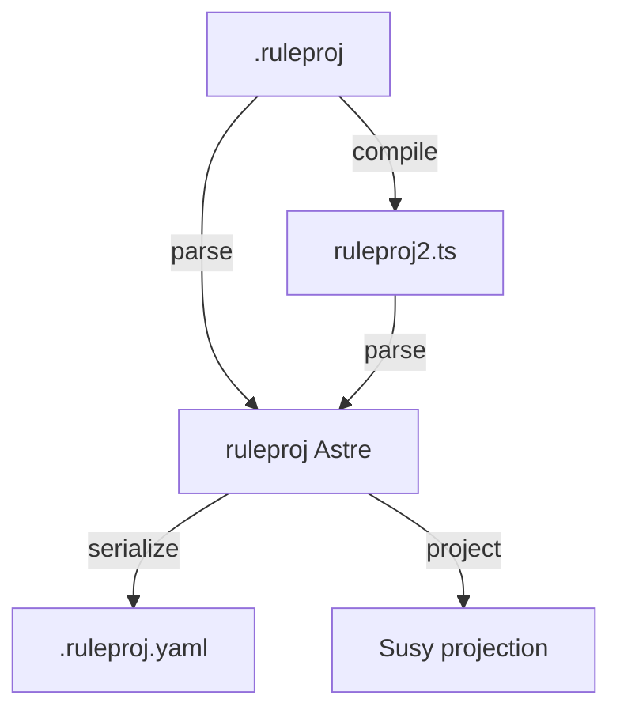

# Projection DSL (Indent Blocks)

This document defines an indentation-first projection DSL for Susy
projections. This DSL is rule based, so the suffix is `.ruleproj`.
It is designed for block structures, with inline structures
remaining single-line. It targets projectional editing, not parsing.

## Projection Definition

A projection maps an Astre (augmented syntax tree) into a Susy
representation suitable for editing. It is a structured, reversible
view, not a parser. It does not change the underlying Astre.

Should we call this “astral projection” in docs and UI? If we do,
we should use it consistently and avoid mixing terms.

## Goals

- Define projections as data, not ad-hoc functions.
- Use indentation as syntax for blocks, without explicit open or close tokens.
- Keep inline structures single-line and brace-free.
- Support quote and unquote style templating without full macros.
- Be language-agnostic, then specialize with per-language rule sets.

## Core Model

The rule engine takes:

- An AST (Astre) with stable node kinds and fields.
- A rule set that projects a node into Susy lines.
- A channel budget that controls indentation, text, and style.

Rules are ordered. The first matching rule wins.

## Naming and Embedding

`kt` is a combined key in the form `KindName.TypeName`, joined by a dot.
A single AST node
can be embedded in multiple contexts and take on different `kt` values,
including double embedding (e.g., a TypeScript variable embedded in an
augmented YAML Astre, itself embedded in an augmented Acorn Astre).

This DSL is also edited as a projection, so string literals are naked by
default and do not require quotes.

## Ruleproj to TypeScript

`.ruleproj` files are turned into TypeScript by a small compiler.
Today the pipeline is:

1. `parseRuleproj` tokenizes and parses the DSL into rule objects.
2. Rule objects are matched against a normalized Astre node.
3. The selected rule emits Susy tokens and lines.

In code, the implementation lives in:

- `/Users/cog/mine/lush-all/lush-types/ruleproj.ts` for parsing.
- `/Users/cog/mine/lush-all/lush-types/susy-svelte-leste-projection.ts` for
  rule application.

Example (`svelte-leste.ruleproj`):

```
rule Text
  match
    type: Text
    data: $text
  emit
    line: text($text)
```

The generated TypeScript logic is equivalent to:

```
if (node.type === 'Text') {
  const text = node.data
  return renderTextTokens(text)
}
```

The compiler is intentionally small and explicit: it maps DSL `match`
fields to structured predicates and maps `emit` expressions to token
builders. This keeps the generated code easy to inspect and adjust.

## Ruleproj Dogfood Plan

We want to use `.ruleproj` to generate the code that parses `.ruleproj`
files and to project ruleproj Astres themselves.

Plan:

1. Use a `.ruleproj` to generate `ruleproj2.ts`, the parser for
   `.ruleproj`.
2. Define a projection format for `.ruleproj` and generate projections
   from ruleproj Astres.
3. Define `.ruleproj.yaml` as the YAML serialization of the Astre for
   the corresponding `.ruleproj` file.

Mermaid overview:



## DSL Overview

The DSL is indentation-based and uses `rule`, `match`, and `emit`.
The `emit` block is a template with splice points.

Example:

```
rule ElementBlock
  match
    kt: "Svelte.Element"
    name: $name
    attrs: $attrs
    kids: $kids
    where: count($kids) > 0
  emit
    line: tag($name) + attrs($attrs)
    block
      each: $kids
```

## Syntax

Rule header:

```
rule RuleName
  match
    kt: "KindName.TypeName"
    field: $capture
    where: predicate($capture)
  emit
    line: "text " + $capture
```

Captures:

- `$name` captures a field or subnode.
- `$...` indicates a list capture.
- `where:` is a boolean guard.

Emit templates:

- `line:` renders a single line.
- `block` creates an indented block.
- `each:` projects a list of nodes.
- `node:` projects a single node.
- `text:` renders raw text.

Template helpers:

- `tag(name)` renders a tag token with style.
- `attrs(list)` renders attributes using a shared style policy.
- `join(list, ", ")` joins text with a separator.
- `indent()` returns the current indentation.

## Quote and Unquote

Quote and unquote are template operations, not macros.

- Quote is any `emit` template.
- Unquote is any `$capture` or `node:` insertion.

Example:

```
rule IfBlock
  match
    kt: "Ts.If"
    test: $test
    then: $then
    else: $else
  emit
    line: "if " + expr($test)
    block
      node: $then
    when: $else
      line: "else"
      block
        node: $else
```

## Hygiene

Hygienic macros are only needed when a rule introduces new bindings.
Most projection rules do not create identifiers, so hygiene can be optional.

If hygiene is needed:

- `fresh("name")` produces a unique identifier.
- `bind(name, node)` scopes a name to a subtree.
- `capture(name)` resolves to a scoped binding.

## Blocks vs Inline

Rules choose block or inline output:

- Inline: single line, no indentation.
- Block: `line` header plus an indented `block`.

Rules can use size guards:

```
where: fitsInline($kids, 40)
```

If the guard fails, a later rule can emit a block version.

## Svelte Rule Set

This section applies the DSL to Svelte with indentation syntax for tags
and braces.

### Elements

Inline elements render a single line with inlined children:

```
rule ElementInline
  match
    kt: "Svelte.Element"
    name: $name
    attrs: $attrs
    kids: $kids
    where: fitsInline($kids, 40)
  emit
    line: tag($name) + attrs($attrs) + inlineKids($kids)
```

Block elements render a header line and an indented body.
No closing tag is emitted.

```
rule ElementBlock
  match
    kt: "Svelte.Element"
    name: $name
    attrs: $attrs
    kids: $kids
  emit
    line: tag($name) + attrs($attrs)
    block
      each: $kids
```

### Text

```
rule Text
  match
    kt: "Svelte.Text"
    value: $value
  emit
    line: $value
```

### Svelte Blocks

```
rule IfBlock
  match
    kt: "Svelte.IfBlock"
    test: $test
    then: $then
    else: $else
  emit
    line: "{#if " + expr($test) + "}"
    block
      node: $then
    when: $else
      line: "{:else}"
      block
        node: $else
```

The braces remain in the projection but indentation replaces the end tags.
If you want braces removed as well, use a second projection profile:

```
rule IfBlockNoBraces
  match
    kt: "Svelte.IfBlock"
    test: $test
    then: $then
    else: $else
  emit
    line: "if " + expr($test)
    block
      node: $then
    when: $else
      line: "else"
      block
        node: $else
```

### Script Blocks

Script blocks use indentation instead of braces for TypeScript.

```
rule ScriptBlock
  match
    kt: "Svelte.Script"
    lang: $lang
    body: $body
  emit
    line: "script " + attr("lang", $lang)
    block
      node: $body
```

```
rule TsBlock
  match
    kt: "Ts.Block"
    kids: $kids
  emit
    block
      each: $kids
```

```
rule TsIf
  match
    kt: "Ts.If"
    test: $test
    then: $then
    else: $else
  emit
    line: "if " + expr($test)
    block
      node: $then
    when: $else
      line: "else"
      block
        node: $else
```

## Example Output

Example Svelte:

```
<script lang="ts">
  if (ready) {
    count += 1
  }
</script>

<div class="wrap">
  <h1>{title}</h1>
  <p>{subtitle}</p>
</div>
```

Projected Susy:

```
script lang=ts
  if ready
    count += 1

div .wrap
  h1 {title}
  p {subtitle}
```

## Next Steps

- Expand rule coverage for more Svelte node types.
- Add richer `where` predicates and helper functions.
- Support multi-line emit templates and spans.
- Keep growing the `.ruleproj` samples.
